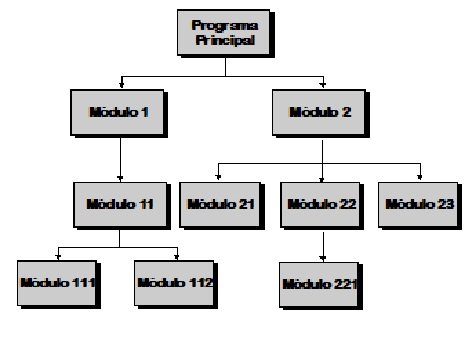
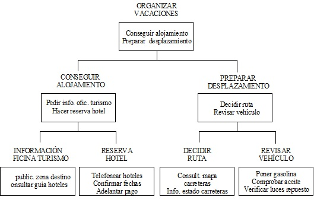

   

<br>
<br>

# Tema 4. Programación Modular 

[*1.	Introducción*](#_apartado1)

[*2.	Subprogramas*](#_apartado2)

[*3.	Paso de parámetros*](#_apartado3)

[*4.	Ejemplo de función*](#_apartado4)

[*5.	Parámetros por nombre*](#_apartado5)

[*6.	Funciones delegadas y funciones lambda*](#_apartado6)


# <a name="_apartado1"></a>1. Introducción.

La forma más razonable de encarar el desarrollo de un programa complicado es aplicar  lo  que  se  ha  dado  en  llamar  **Programación  Top  -  Down**  o  Programación descendente. 

El diseño descendente resuelve un problema efectuando descomposiciones en otros  problemas  más  sencillos  a  través  de  distintos  niveles  de  refinamiento.  La programación modular consiste en resolver de forma independiente los subproblemas resultantes de una descomposición. El resultado de dividir reiteradas veces un problema en problemas más pequeños es una estructura jerárquica o en árbol. 

El  código  de  un  programa,  además  de  para  realizar  una  cierta  acción,  debe escribirse  pensando  que  posteriormente  **puede  ser  necesario  modificarlo  o mantenerlo** y que la persona encargada de ello puede ser la misma que ha creado inicialmente el programa u otra distinta. Tomando esto como base, es necesario que el código  de  un  programa  sea  lo  más  claro  posible  y  uno  de  los  elementos  que  más contribuye a esta claridad es precisamente la modularidad.  

La  modularidad  consiste  en  la  **división  de  un  programa  en  distintos componentes o módulos**, cada uno de los cuales tendrá un nombre o identificativo propio y una ubicación determinada dentro del programa y que se podrán invocar y ejecutar.  




La operación  de estructurar un programa comienza desde su propio análisis, momento  en el  que se ha de determinar qué operaciones será necesario realizar  en distintos puntos, qué bloques de código se repetirán a lo largo del programa, etc. A partir de estos datos procederemos a aislar esas porciones de código del código general del programa, creando los **subprogramas** que sean convenientes. Cada una de estas entidades actuará como si se tratase de un pequeño programa, al que se llama cuando es necesario, pasando y obteniendo los parámetros apropiados.  

Mantener  el  código  de  un  programa  que  está  estructurado  en  múltiples subprogramas  es  mucho  más  simple,  ya  que  el  programador  sabe  que  el  código existente en uno de estos bloques es totalmente independiente del código del resto de programa y que, por lo tanto, lo puede analizar separadamente de forma más fácil. 

**Ejemplo.**  Realizar  el  análisis  descendente  de  la  tarea  de  ORGANIZAR VACACIONES 



<br>
<br>

# <a name="_apartado2"></a>2. Subprogramas.

Un **subprograma**, también denominado **método** o **función**, es un conjunto de operaciones o sentencias identificado mediante un nombre único. Toda referencia o llamada a este nombre implica la **ejecución de las operaciones contenidas** en dicha función o procedimiento. 

Constituyen módulos o bloques que resuelven  un problema parcial  y que se pueden utilizar en cualquier parte del código. Se utilizan para ayudar a organizar y simplificar programas largos y complejos.  

Se debe utilizar un subprograma cuando el conjunto de operaciones que define se  va  a  utilizar  en  más  de  un  lugar  de  nuestro  código  **evitando  de  esta  forma  la duplicidad del código**.  

También se debe utilizar una función cuando hace **más fácil comprender la lógica del programa y su mantenimiento**. 

Características de los subprogramas: 

- La llamada a un subprograma en un programa da como resultado la ejecución del cuerpo de la función. Se ejecuta hasta que se alcanza la última sentencia (o se ejecuta la sentencia **return**), momento en el cual se transfiere de nuevo el control al programa principal o subprograma que lo hubiera llamado. 

- La forma de comunicar la información a una función es mediante los argumentos o **parámetros**. 
   
- El subprograma debe definirse antes de poder utilizarse. 

Un  subprograma  **ha  de  definirse  antes  de  su  utilización,**  estableciendo  el identificador por el que se le conocerá, los parámetros que necesita y el bloque de código a ejecutar.  

En dicho bloque el subprograma o método puede declarar sus propias variables, tipos,  etc.,  de  forma  similar  a  como  haríamos  en  el  bloque  principal,  con  la  única diferencia de que los identificadores creados tendrían un ámbito local. 

Como  hemos  dicho  un  subprograma  o  función  consiste  en  una  serie  de sentencias en C# que realiza una acción determinada y devuelve un valor. 

## Sintaxis para crear una función

  La forma general para crear una función es: 

```csharp
tipo nombreFuncion(parametros)
{
   sentencias;

   return valor;
}

```
### Ejemplo de función 

El siguiente código crea una función denominada **cuadrado** que devuelve el cuadrado de un número entero (*int*): 

```csharp
// Función que devuelve el cuadrado de un valor.
int cuadrado(int valor)
{
   // res será una variable local.
   int res;
   
   res = valor * valor;

   // La sentencia return hace que la función devuelva 
   // el valor contenido en res.
   return res;
}
```

Vamos a analizar línea a línea la función cuadrado. 

`int cuadrado(int valor)`

es la cabecera de la función. Indica que la función se llama `cuadrado`, que devuelve un valor de tipo entero (`int`) y que se le pasa un parámetro de tipo `int` (más adelante veremos con más tranquilidad el concepto de parámetro). 

`int res;` 

Estamos definiendo una variable local. Su ámbito de uso es nuestra función.             

`res = valor * valor;` 

Sentencia de asignación. 

`return res;` 

Hace que nuestra función devuelva el valor contenido en la variable `res`. 

Si luego quisiéramos llamar a la función cuadrado lo podríamos hacer de la siguiente forma: 

```csharp
private void btnCalcularCuadrado_Click(object sender, EventArgs e)
{
   int num, resultado;

   num = int.Parse(txtNum.Text);

   resultado = cuadrado(num);

   MessageBox.Show("El cuadrado de " + num + " es " + resultado);
}
```

### Ejemplo de función (suma de dos números): 

```csharp
int suma(int num1, int num2)
{
   // res será una variable local.
   int res;

   res = num1 + num2;

   // Devolvemos el valor contenido en res
   return res;
}

private void btnSumar_Click(object sender, EventArgs e)
{
   int n1, n2, result;

   n1 = int.Parse(txtNum1.Text);
   n2 = int.Parse(txtNum2.Text);

   // Llamamos a la función pasando los parámetros
   // y recogiendo el valor que devuelve.
   result = suma(n1, n2);

   MessageBox.Show("El resultado de la suma es " + result);
}
```

### Vamos a ver este mismo ejemplo en un proyecto de Consola y repasamos:

```csharp
// Función que devuelve la suma de dos números.
// Las funciones en Consola deben ser static.
// Esto lo explicaremos al ver Orientado a Objetos
static int suma(int num1, int num2)
{
    // res será una variable local.
    int res;

    res = num1 + num2;

    // Devolvemos el valor contenido en res
    return res;
}

static void Main(string[] args)
{
    int n1, n2, result;

    Console.Write("Introduzca el primer número: ");
    n1 = int.Parse(Console.ReadLine());
    Console.Write("Introduzca el segundo número: ");
    n2 = int.Parse(Console.ReadLine());

    // Llamamos a la función pasando los parámetros
    // y recogiendo el valor que devuelve.
    result = suma(n1, n2);

    Console.WriteLine($"El resultado de la suma es {result}.");
}
```


Podría ocurrir que una función no necesite devolver ningún valor (en algunos lenguajes esto se denomina **procedimiento**). En ese caso el tipo que devuelve la función es `void`, lo cual indica que no devuelve nada y no es necesario utilizar `return`. 

### Ejemplo de función void: 

```csharp
// Función void. No devuelve ningún valor
void versionPrograma(int num)
{
   string texto;

   texto = "Esta es la versión "+ num + " de nuestro programa.";
   MessageBox.Show(texto);
}
        
private void btnVersion_Click(object sender, EventArgs e)
{
   versionPrograma(5);
}
```

<br>
<br>

# <a name="_apartado3"></a>3. Paso de parámetros

Como  hemos  dicho  los  parámetros  son  la  forma  de  comunicación  entre  el programa principal y los subprogramas. Es la forma de **pasar datos** a las funciones o subprogramas. Estos parámetros pueden ser de *entrada*, de *salida* o de *entrada/salida*.  

Un aspecto importante en la programación modular es cómo se pasan o reciben las funciones y procedimientos. A este proceso se le conoce como paso de parámetros. Hay dos formas de paso de parámetros: 

1. **Parámetros por valor:** Pueden ser variables o constantes que no cambian su valor en el cuerpo del subprograma. Son sólo **datos de entrada**. 
2. **Parámetros  por  referencia:**  Son  variables  que  en  el  cuerpo  del subprograma pueden cambiar su valor. Son **datos de entrada y salida**.  

Es decir, cuando se pasa un parámetro por referencia se le indica al subprograma la posición en memoria donde está ubicada la variable que le pasas como parámetro; de esta  forma  los  cambios  de  valor  que  se  efectúen  en  dicha  variable  son  definitivos incluso cuando dicha subrutina termine. 

**Cuando definimos una función** en Visual C# .NET, describimos los datos y los tipos de datos para los que la función está diseñada para aceptar desde un subprograma que la llame. Los elementos definidos en la cabecera de la función se denominan ***parámetros***. 

**Cuando llamamos a la función**, sustituimos un valor actual de cada parámetro. Los valores que pasamos en la posición de los parámetros se denominan ***argumentos***. 

A pesar de esta sutil diferencia, los términos *argumento* y *parámetro* a menudo se utilizan indistintamente.  

- El número de argumentos que pasamos al llamar a la función debe coincidir con el número de parámetros que espera la función.  
  
- El **orden de los argumentos influye**, es decir, al primer argumento se le asigna  el  primer  parámetro,  al  segundo  argumento  se  le  asigna  el segundo parámetro y así sucesivamente. Aunque, como veremos en el siguiente podemos pasar argumentos con nombre, indicando el nombre del parámetro como veremos en un apartado posterior. Esto se puede cambiar, como veremos más adelante, con los parámetros por nombre.
- El **tipo** del argumento debe coincidir con el tipo de parámetro al que esté asociado. 
  
<br>

## Parámetros por valor. Parámetros de entrada.

El paso de parámetros por valor **es la forma por defecto** en la que se pasan los parámetros a las funciones de C#. 

En  los  ejemplos  que  hemos  visto  en  los  apartados  anteriores  se  pasaban  los parámetros por valor, es decir, si cambiara el valor del parámetro dentro de la función, ese cambio no se transmite al argumento de la llamada. Son **parámetros de entrada**, es decir, nos permiten pasar datos al subprograma. 

### Ejemplo de parámetro por valor: 

```csharp
void dobleValor(int num)
{
   num = num * 2;
   // Aquí imprimirá el valor 20
   MessageBox.Show(num.ToString());
}

private void btnValor_Click(object sender, EventArgs e)
{
   int num;

   num = 10;
   dobleValor(num);

   // El valor de la variable num sigue siendo 10
   MessageBox.Show("El valor de la variable num es " + num);
}
```
Como vemos en este ejemplo `num` en el botón no ha cambiado su valor a pesar de que en el subprograma sí se cambia. 

<br>

## Parámetros por Referencia. Salida o Entrada/Salida

Para definir un parámetro por referencia se pueden utilizar la palabra reservada `ref` o `out`.  

Esto  nos  permitirá  tener  parámetros  de  entrada/salida  (`ref`)  y  parámetros  de salida (`out`). 

Como hemos dicho antes, cuando definimos un parámetro por referencia, si éste cambia de valor el cambio se transmite al argumento y, por tanto, al botón o función desde donde ha sido llamada la función. 

La diferencia entre `ref` y `out` es que cuando utilizamos `ref` el argumento debe haber  sido  inicializado  antes  de  llamar  a  la  función  (o  tendremos  un  error  de compilación) mientras que con `out` no es necesario. 

Los parámetros **`ref` se podrían ver como parámetros de entrada/salida** y los **`out` como parámetros de salida**. 

### Ejemplo de parámetro por referencia: 

```csharp

void dobleReferencia(ref int num)
{
   num = num * 2;
   // Aquí imprimirá el valor 20
   MessageBox.Show(num.ToString());
}

private void btnReferencia_Click(object sender, EventArgs e)
{
   int num;

   num = 10;
   dobleReferencia(ref num);

   // El valor de la variable num pasa a ser 20
   MessageBox.Show("El valor de la variable num es " + num);
}
```

Notar que al **llamar** a una función con un parámetro por referencia hay que poner `ref` delante del argumento en la llamada. 

Vamos a realizar un ejemplo en el que **calculemos la nota media a partir de las notas de las 3 evaluaciones**. Lo vamos a hacer con una función que devuelva la media mediante `return` y con una función `void` que devuelva la media en un parámetro de salida. 

### Ejemplo con función: 

```csharp
double mediaFuncion(double nota1, double nota2, double nota3)
{
   double res;

   res = (nota1 + nota2 + nota3) / 3;

   return res;
}
       
private void btnMediaFuncion_Click(object sender, EventArgs e)
{
   double n1, n2, n3, media;

   n1 = double.Parse(txtNota1.Text);
   n2 = double.Parse(txtNota2.Text);
   n3 = double.Parse(txtNota3.Text);

   media = mediaFuncion(n1, n2, n3);

   MessageBox.Show("La media es " + media);
}
```

### Ejemplo con parámetro out: 

```csharp
void mediaReferencia(double nota1, double nota2, double nota3, out double res)
{
   res = (nota1 + nota2 + nota3) / 3;
}

private void btnReferencia_Click(object sender, EventArgs e)
{
   double n1, n2, n3, media;

   n1 = double.Parse(txtNota1.Text);
   n2 = double.Parse(txtNota2.Text);
   n3 = double.Parse(txtNota3.Text);

   mediaReferencia(n1, n2, n3, out media);

   MessageBox.Show("La media es " + media);
}

```

<hr>

## ¿Cuándo devolver valores por return o por parámetros por referencia?

En muchas ocasiones puede resultar confuso, a la hora de utilizar un subprograma, decidir si devolver valores mediante return o mediante parámetros por referencia. 

Una posible regla a aplicar puede ser la siguiente: 

- Si el subprograma va a devolver **un solo valor**, utilizar `return`. 
  
- Si el subprograma **no va a devolver valor** o va a devolver **más de un valor,** entonces  utilizar  función  `void`  (no  devuelve  nada)  y  devolver  los  valores mediante varios parámetros por referencia. 

A continuación, os planteo varios posibles ejemplos. 

1. Imaginemos que queremos realizar un subprograma que devuelva la potencia de un número elevado a otro. 

   En este caso lo mejor es utilizar una función con dos parámetros por valor (la base y el exponente) y que devuelva mediante `return` el resultado de la potencia. 

2. Si  queremos  hacer  un  subprograma  que  simplemente  imprima  algo  por pantalla se puede utilizar una función `void`. 
3. Imaginemos que queremos hacer un subprograma que devuelva el valor de la división entera y del resto entre dos números. 

   En este caso lo mejor sería hacer una función void con 4 parámetros, dos de entrada: el primer número y el segundo número, y otros dos parámetros de salida (`out`): el resultado de la división y el resto. 

4. Si  quisiéramos  hacer  un  subprograma  que  intercambie  el  valor  de  dos números,  lo  mejor  sería  hacer  una  función  void  con  dos  parámetros  de entrada/salida (`ref`). 

<hr>

<br>

# <a name="_apartado4"></a>4. Ejemplo de creación de función

En este apartado vamos a resolver uno de los ejercicios que luego se plantean, paso a paso.

En el tema anterior, resolvimos un problema en el que obteníamos la potencia de un número elevado a otro. 
Nos encontramos con la situación en que, si quisiéramos calcular la potencia de un número elevado a otro en varios puntos de nuestro programa, necesitaríamos **copiar ese código** para poder hacerlo, al no haber trabajado todavía con la **programación modular**.

Vamos ahora a realizar la función que nos permita calcular esa potencia y, mientras lo hacemos, vamos a discutir distintos detalles.

Recordamos una posible solución a este problema **sin tener en cuenta la programación modular**:

```csharp
private void btnCalcular_Click(object sender, EventArgs e)
{
   int vBase, vExponente, vPotencia;

   vBase = int.Parse(txtBase.Text);
   vExponente = int.Parse(txtExponente.Text);

   vPotencia = 1;

   for(int i = 1; i <= vExponente; i++)
   {
         vPotencia *= vBase;
   }

   MessageBox.Show($"El resultado de la potencia es: {vPotencia}");
}
```

Vamos a pensar una posible solución **utilizando programación modular**, realizando una función sin parámetros, y que no devuelve valor. 

```csharp
void potencia()
{
   int vBase, vExponente, vPotencia;

   vBase = int.Parse(txtBase.Text);
   vExponente = int.Parse(txtExponente.Text);

   vPotencia = 1;

   for (int i = 1; i <= vExponente; i++)
   {
         vPotencia *= vBase;
   }

   MessageBox.Show($"El resultado de la potencia es: {vPotencia}");
}

private void btnCalcular_Click(object sender, EventArgs e)
{
   potencia();            
}
```

Aunque esta solución funciona, **no es correcta**.

Nuestra función está leyendo los valores de la base y del exponente, calcula la potencia y muestra el resultado de la misma.

El problema es que haciéndolo de esta manera, la **función no es genérica**. 
- ¿Qué pasa si los datos no los queremos leer desde textBox, sino desde InputBox?
 
- ¿Y si el resultado no lo queremos imprimir en un MessageBox sino en un label, o en un textBox?
- O si directamente queremos calcular la potencia de 5 elevado a 3.

Pues tal y como tenemos planteada nuestra función, no lo podríamos hacer. Debemos tener en cuenta que nuestra función debe ser lo más genérica posible, para que se pueda utilizar de distintas formas.

Cuando definimos una función **debemos evitar leer los datos dentro de la misma y tambien debemos evitar mostrar los resultados**.

Para ello utilizaremos los parámetros y return.

Nuestra función en concreto recibe dos valores y devuelve un resultado. Por tanto, tendremos dos parámetos de entrada y un return.

```csharp
int potencia(int bbase, int exponente)
{
   int res;
   res = 1;

   for (int i = 1; i <= exponente; i++)
   {
         res *= bbase;
   }

   return res;
}

private void btnCalcular_Click(object sender, EventArgs e)
{
   int vBase, vExponente, vPotencia;

   vBase = int.Parse(txtBase.Text);
   vExponente = int.Parse(txtExponente.Text);

   vPotencia = potencia(vBase, vExponente);

   MessageBox.Show($"El resultado de la potencia es: {vPotencia}");
}
```

De esta manera, nuestra función recibe los valores de la base y el exponente, y devuelve el resultado.

Si por ejemplo, quisiéramos obtener 5 elevado a 3 y mostrarlo en un label, lo podríamos hacer así:

```csharp
private void btnCalcular_Click(object sender, EventArgs e)
{
   int res;

   res = potencia(5, 3);

   lblResultado.Text = res.ToString();
}
```

Utilizando la misma función que habíamos definido ya correctamente.

**Vamos a ver el mismo ejemplo en Consola**. Únicamente ponemos el código:

```csharp
static int potencia(int bbase, int exponente)
{
    int res;
    res = 1;

    for (int i = 1; i <= exponente; i++)
    {
        res *= bbase;
    }

    return res;
}

static void Main(string[] args)
{
    int vBase, vExp, result;

    Console.Write("Introduzca la base: ");
    vBase = int.Parse(Console.ReadLine());
    Console.Write("Introduzca el exponente: ");
    vExp = int.Parse(Console.ReadLine());

    // Llamamos a la función pasando los parámetros
    // y recogiendo el valor que devuelve.
    result = potencia(vBase, vExp);

    Console.WriteLine($"{vBase} elevado a {vExp} es {result}.");
}
```

<br>
<br>

# <a name="_apartado5"></a>5. Argumentos por nombre y opcionales

Como hemos estudiado en apartados anteriores, a la hora de llamar a una función el orden de los argumentos es fundamental a la hora de asignarlos a los parámetros de la función.

Así cuando hacemos:

```csharp
   res = potencia(5, 3);
```
`res` tomará el valor 125 (5 elevado a 3), mientras que si la llamada fuera:

```csharp
   res = potencia(3, 5);
```

`res` tomará el valor 243 (3 elevado a 5).

Existe en csharp, al igual que en muchos lenguajes modernos, la posibilidad de llamar a una función **indicando el nombre del parámetro**, en cuyo caso no hace seguir el orden establecido en la llamada. 
Además, esto puede hacer más clara la comprensión de la llamada:

```csharp
   res = potencia(bbase: 5, exponente: 3);
```

Igualmente podemos hacer:

``` csharp
   res = potencia(exponente: 3, bbase: 5);
```

Vamos a ver el ejemplo en el que pedíamos el valor de los argumentos que vimos en el apartado anterior:

```csharp
private void btnCalcular_Click(object sender, EventArgs e)
{
   int vBase, vExponente, vPotencia;

   vBase = int.Parse(txtBase.Text);
   vExponente = int.Parse(txtExponente.Text);

   vPotencia = potencia(bbase: vBase, exponente: vExponente);

   MessageBox.Show($"El resultado de la potencia es: {vPotencia}");
}
```

Existe la posibilidad de **tener parámetros opcionales** en una función. Para hacer un parámetro opcional (que deben ir detrás de los parámetros obligatorios), debemos darle un valor en la definición de la función.
En el caso que en la llamada no pongamos algún argumento opcional, tomará el valor que hayamos puesto en la definición.

Vamos a realizar una función a la cual le pasemos el nombre de una persona, su edad y la ciudad de nacimiento. Esta función devolverá un texto con los datos de esa persona.
Los parámetros edad y ciudad de nacimiento serán opcionales:

```csharp
static string datosPersonales(string nombre, int edad = 50,
                        string ciudadNacimiento = "Alicante")
{
    string estatus = "Bebé";
    string texto;

    if (edad >= 1 && edad < 12)
    {
        estatus = "Niño/a";
    }
    else if (edad >= 12 && edad < 18)
    {
        estatus = "Adolescente";
    }
    else if (edad >= 18 && edad < 65)
    {
        estatus = "Adulto/a";
    }
    else if (edad >= 65)
    {
        estatus = "Jubilado/a";
    }

    texto = $"Nombre: {nombre}, Edad: {edad} ({estatus}), Ciudad: {ciudadNacimiento} ";

    return texto;
}

static void Main(string[] args)
{
    // Aquí tenemos varios ejemplos 
    // de llamada a la función.
    Console.WriteLine(datosPersonales("David", 52, "Granada"));
    Console.WriteLine(datosPersonales("Juan"));
    Console.WriteLine(datosPersonales("Ana", 18));
    Console.WriteLine(datosPersonales("María", 15, "Elche"));

    // Además podemos utilizar parámetros por nombre
    Console.WriteLine(datosPersonales(nombre: "Miguel", edad: 79, ciudadNacimiento: "Barcelona"));
    Console.WriteLine(datosPersonales(nombre: "Pablo", ciudadNacimiento: "Alicante"));
    // En cuyo caso podemos cambiar la posición
    Console.WriteLine(datosPersonales(ciudadNacimiento: "Valencia", nombre: "Paula", edad: 55));

    // E incluso podemos mezclar parámetros por posición y por nombre, siempre 
    // y cuando los posicionales los escribamos primero
    Console.WriteLine(datosPersonales("Luisa", ciudadNacimiento: "Elche"));

    // Y por supuesto estos argumentos podrían ser variables leídas
    Console.Write("Introduzca el nombre: ");
    string nombre = Console.ReadLine();
    Console.Write("Introduzca la edad: ");
    int edad = int.Parse(Console.ReadLine());

    Console.WriteLine(datosPersonales(nombre: nombre, edad: edad));
}
```

<br>
<br>

# <a name="_apartado6"></a>6.	Funciones delegadas y funciones lambda

En C# existe la posibilidad de hacer que **una función tenga como parámetro otra función**, de manera que luego se pueda utilizar esa función pasada dentro.

Esto se puede hacer mediante **delegados**

## Delegados

Un delegado es un tipo que representa una referencia a un **método**. Los delegados permiten que los métodos se pasen como parámetros, se asignen a variables y se ejecuten dinámicamente en tiempo de ejecución.

Para declarar un delegado, usamos la palabra clave **delegate**, seguida de la firma del método que el delegado representará. Por ejemplo, si el delegado queremos que represente una función que tiene como parámetros dos enteros y devuelve un entero tendrá esta forma:

```csharp
public delegate int Operacion(int a, int b);
```

Luego, podremos poner en una función `Operacion` como parámetro.

Vamos a intentar enteder este concepto con un ejemplo en el que trabajamos con funciones que calculan operaciones básicas (suma, resta...):

Podríamos definir en primer lugar estas operaciones como funciones:

```csharp
int suma(int x, int y)
{
   return x + y;
}

int resta(int x, int y)
{
   return x - y;
}

int producto(int x, int y)
{
   return x * y;
}
```

Y luego utilizarlas llamándolas cuando nos interese, tal y como hemos hecho hasta ahora:

```csharp
private void btnCalcular_Click(object sender, EventArgs e)
{
   int res;

   res = suma(5, 3);
   MessageBox.Show($"El resultado es {res}");

   res = resta(5, 3);
   MessageBox.Show($"El resultado es {res}");

   res = producto(5, 3);
   MessageBox.Show($"El resultado es {res}");
}
```

Lo que vamos a hacer a continuación, para entender el concepto de **delegado** y **función como parámetro** es crearlos:

```csharp
// Creamos el delegado dando nombre y firma del método
delegate int Operacion(int a, int b);
```

Vamos a crear ahora una función que espera como parámetro los dos valores y la función delegada que luego le pasaremos por parámetro:

```csharp
// Esta es una función que espera dos valores y 
// la operación a realizar con esos dos valores.
// Devuelve un texto, pero podría devolver un valor también
string ejecutarOperacion(int a, int b, Operacion operacion)
{
   int res;

   res = operacion(a, b);

   return $"El resultado es {res}";
}
```

Y ahora podemos llamar a `ejecutarOperacion` pasándole los valores y la función:

```csharp
private void btnCalcular_Click(object sender, EventArgs e)
{
   MessageBox.Show(ejecutarOperacion(5, 3, suma));

   MessageBox.Show(ejecutarOperacion(5, 3, resta));

   // Aquí la llamamos con la función potencia
   MessageBox.Show(ejecutarOperacion(5, 3, potencia));

   // Podemos utilizar variables
   int n1 = int.Parse(Interaction.InputBox("Introduzca un valor"));
   int n2 = int.Parse(Interaction.InputBox("Introduzca otro valor"));

   string texto = ejecutarOperacion(n1, n2, potencia);   
}
```

Otra posibilidad a la hora de haber definido ejecutarOperacion es haber utilizado la palabra reservada `Func` que nos permite definir un delegado genérico directamente en la definición de la función:

```csharp
string ejecutarOperacionConFunc(int a, int b, Func<int, int, int> funcion)
{
   int res;

   res = funcion(a, b);

   return $"El resultado es {res}";
}
```

Al indicar `Func<int, int, int> funcion` estamos diciendo que `ejecutarOperacionConFunc` espera al ser llamada una función que devuelve un `int` y tiene dos `int` como parámetros.

## Funciones lambda

Las **funciones lambda** en C# son una forma concisa y expresiva de definir funciones anónimas. Son especialmente útiles para **operaciones simples que se utilizan una sola vez**.

La sintaxis general de una función lambda es:

```csharp
(parametros) => expresion
```

Donde se ponen los *parámetros de entrada* de la función lambda, separados por comas si hay más de uno y la *expresión* que se evalúa y devuelve como resultado de la función lambda.

Si nos damos cuenta, algunas de las funciones que utilizamos en el parámetro delegado son simplemente una linea. Se pueden sustituir por expresiones lambda, que ejecutarán el cuerpo de la misma:

```csharp
private void btnCalcularLambda(object sender, EventArgs e)
{
   MessageBox.Show(ejecutarOperacionConFunc(5, 3, (x, y) => x + y));

   MessageBox.Show(ejecutarOperacionConFunc(5, 3, (x, y) => x * y));

   // Podemos utilizar variables
   int n1 = int.Parse(Interaction.InputBox("Introduzca el dividendo"));
   int n2 = int.Parse(Interaction.InputBox("Introduzca el divisor"));

   string texto = ejecutarOperacionConFunc(n1, n2, (x, y) => x / y);
   MessageBox.Show(texto);
}
```

<br>
Os dejamos a continuación el **ejemplo completo**, esta vez en un proyecto de **Consola**:

```csharp
// Declaración de las funciones
static int suma(int x, int y)
{
    return x + y;
}

static int resta(int x, int y)
{
    return x - y;
}

static int producto(int x, int y)
{
    return x * y;
}

static int potencia(int bbase, int exponente)
{
    int res;
    res = 1;

    for (int i = 1; i <= exponente; i++)
    {
        res *= bbase;
    }

    return res;
}

// Creamos el delegado dando nombre y firma del método
delegate int Operacion(int a, int b);

// Esta es una función que espera dos valores y 
// la operación a realizar con esos dos valores.
// Devuelve un texto, pero podría devolver un valor también
// Utiliza un delegado para definir parámetros y 
// lo que devuelve la función que se le pasa
static string ejecutarOperacion(int a, int b, Operacion operacion)
{
    int res;

    res = operacion(a, b);

    return $"El resultado es {res}";
}

// A esta función se le pasa una función como parámetro
// mediante Func
static string ejecutarOperacionConFunc(int a, int b, Func<int, int, int> funcion)
{
    int res;

    res = funcion(a, b);

    return $"El resultado es {res}";
}


static void Main(string[] args)
{
    int res;

    // Llamando a las funciones
    res = suma(5, 3);
    Console.WriteLine($"El resultado es {res}");

    res = resta(5, 3);
    Console.WriteLine($"El resultado es {res}");

    // Directamente en la cadena interpolada
    Console.WriteLine($"El resultado es {producto(5, 3)}");

    // Utilizamos la función con el delegado
    // Se llama con distintas funciones como parámetro
    Console.WriteLine(ejecutarOperacion(5, 3, suma));
    Console.WriteLine(ejecutarOperacion(5, 3, resta));
    Console.WriteLine(ejecutarOperacion(5, 3, potencia));

    // Podemos utilizar variables
    Console.Write("Introduzca la base: ");
    int n1 = int.Parse(Console.ReadLine());
    Console.Write("Introduzca el exponente: ");
    int n2 = int.Parse(Console.ReadLine());

    string texto = ejecutarOperacion(n1, n2, potencia);

    // Utilizamos la función con Func
    // Con funciones:
    Console.WriteLine(ejecutarOperacionConFunc(5, 3, suma));
    Console.WriteLine(ejecutarOperacionConFunc(5, 3, producto));

    // Con funciones lambda
    Console.WriteLine(ejecutarOperacionConFunc(5, 3, (x, y) => x + y));
    Console.WriteLine(ejecutarOperacionConFunc(5, 3, (x, y) => x * y));

    // Podemos utilizar variables
    Console.Write("Introduzca el dividendo: ");
    n1 = int.Parse(Console.ReadLine());
    Console.Write("Introduzca el divisor: ");
    n2 = int.Parse(Console.ReadLine());

    texto = ejecutarOperacionConFunc(n1, n2, (x, y) => x / y);
    Console.WriteLine(texto);
}
```


